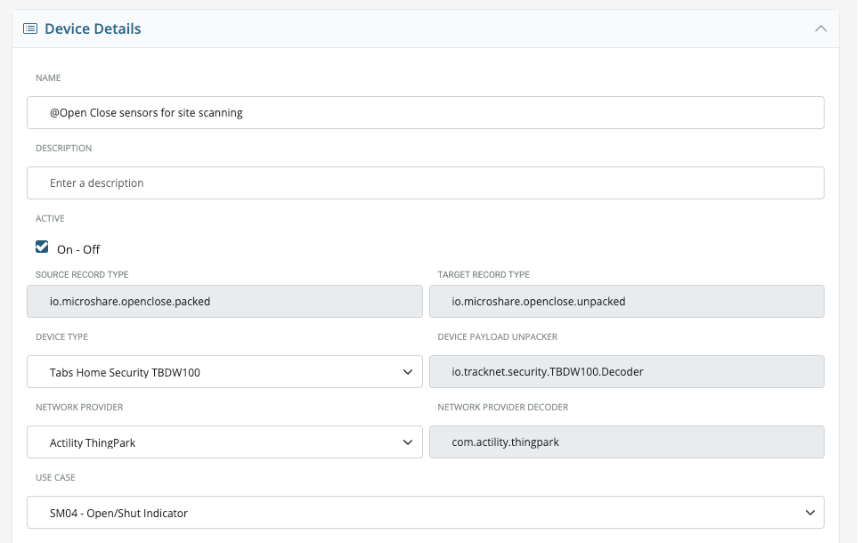

# SiteScan — LoRaWAN Signal Survey App (Alpha)

> **⚠️ Alpha Release** — This is a very initial version of SiteScan. It is functional but rough around the edges. I'm actively looking for feedback on bugs, usability issues, and ideas for further enhancement. If you try it, please [open an issue](https://github.com/cpaumelle/lorawan-signal-scan-with-magnet/issues) or get in touch — all input is welcome.

SiteScan is a mobile progressive web app (PWA) for field technicians to survey LoRaWAN coverage using a Browan Tabs TBDW100 Hall-effect door/window sensor. The technician walks a building, triggers the sensor at each survey point (by passing a magnet near it), taps **Check In** on the app, and SiteScan captures the resulting uplink's RSSI, SNR, spreading factor, and gateway count — classifying the signal into a STRONG / MEDIUM / LOW / NO_SIGNAL band with haptic and audio feedback. At the end of the survey, the app shows a coverage summary and exports the readings as CSV or JSON for reporting.

---

## Two Deployment Options

### Option A: Microshare Composer (Recommended)

Uses the artifacts in [`microshare-native/`](microshare-native/). Everything runs inside the Microshare platform — the app is a Composer Form served from `composer.microshare.io`, authenticated and pre-configured via Composer Facts. No server, no build step, no infrastructure required.

See **[microshare-native/README.md](microshare-native/README.md)** for step-by-step setup instructions.

### Option B: Self-hosted

A React PWA (`app/`) backed by a Python FastAPI CORS proxy (`proxy/`). Use this if you want to self-host outside the Microshare platform, customise the UI, or integrate with your own backend.

- **Proxy**: [`proxy/`](proxy/) — FastAPI server that handles Microshare authentication and proxies API calls (bypasses browser CORS restrictions)
- **App**: [`app/`](app/) — React + Vite + Tailwind PWA; run `npm install && npm run dev` to start locally

The proxy must be running at `http://localhost:8001` (or configure `vite.config.js` to proxy `/proxy` to your deployment URL).

---

## Hardware Required

- **Browan Tabs TBDW100** — Hall-effect LoRaWAN door/window sensor. Triggered by waving the included magnet near the sensor body, which generates an uplink immediately without waiting for the configured report interval.
- Any LoRaWAN gateway compatible with Microshare (e.g. Kerlink, Tektelic, Dragino) within range.

---

## Microshare Prerequisites — Device Cluster Setup

**SiteScan will not work without this.** Before deploying the app, you must have at least one **Device Cluster** in your Microshare account configured for the Browan Tabs TBDW100, with at least one sensor registered to it.

### What to configure

In Composer, go to **Device Clusters** and create (or verify you have) a cluster with these exact settings:

| Field | Value |
|---|---|
| **Device Type** | Tabs Home Security TBDW100 |
| **Use Case** | SM04 - Open/Shut Indicator |
| **Source Record Type** | `io.microshare.openclose.packed` |
| **Target Record Type** | `io.microshare.openclose.unpacked` |
| **Device Payload Unpacker** | `io.tracknet.security.TBDW100.Decoder` |
| **Network Provider** | Your LoRaWAN network (e.g. Actility ThingPark) |

The **Target Record Type** (`io.microshare.openclose.unpacked`) is what SiteScan queries — this must match exactly.



At least one Browan Tabs TBDW100 sensor must be registered in this cluster and within range of a LoRaWAN gateway before you start a survey.

---

## Signal Quality Bands

SiteScan classifies each uplink into one of four bands based on RSSI and SNR:

| Band       | RSSI threshold | SNR threshold | Meaning                                 |
|------------|---------------|---------------|-----------------------------------------|
| STRONG     | > −95 dBm     | > +10 dB      | Excellent coverage, reliable at all SFs |
| MEDIUM     | > −105 dBm    | > +3 dB       | Good coverage, suitable for most use cases |
| LOW        | > −115 dBm    | > −5 dB       | Marginal coverage, may drop at higher SFs |
| NO_SIGNAL  | ≤ −115 dBm    | ≤ −5 dB       | Below usable threshold or no uplink received |

> **Note (v2 / Composer):** Band thresholds are configurable via the `bandThresholds` key in the App Facts JSON. The v1 form uses hard-coded thresholds that match the table above.

---

## Repository Structure

```
lorawan-signal-scan-with-magnet/
├── README.md                          — This file
├── microshare-native/                 — Microshare Composer artifacts (Option A)
│   ├── README.md                      — Step-by-step Composer UI setup guide
│   ├── robot/
│   │   └── sitescan-decode-robot.js   — Robot script: decodes uplinks → sitescan.decoded
│   ├── view/
│   │   └── sitescan-uplinks-view.json — MongoDB pipeline: query decoded records by DevEUI
│   ├── form/
│   │   ├── sitescan-form.html         — v1 form (single-file app UI)
│   │   └── sitescan-form-v2.html      — v2 form (recommended — location tags, ESP display)
│   ├── app/
│   │   ├── sitescan-facts.json        — v1 App Facts template
│   │   └── sitescan-facts-v2.json     — v2 App Facts template (recommended)
│   ├── deploy.mjs                     — Optional: Node.js script to deploy via API
│   └── .env.example                   — Credentials template for deploy.mjs
├── proxy/                             — Python FastAPI CORS proxy (Option B)
│   ├── main.py                        — Proxy server (login + /share/ passthrough)
│   ├── requirements.txt               — Python dependencies
│   └── .env.example                   — Environment variable template
└── app/                               — React PWA (Option B)
    ├── src/
    │   ├── pages/                     — LoginPage, SensorSetupPage, SurveyPage, SummaryPage
    │   ├── components/                — UI components (CheckInButton, SignalHeroCard, etc.)
    │   ├── hooks/                     — useCheckIn, useUplinkStream, usePacketRate
    │   └── services/                  — microshareApi, signalQuality, sessionStore, parseDevEUI
    ├── package.json
    ├── vite.config.js
    └── index.html
```
