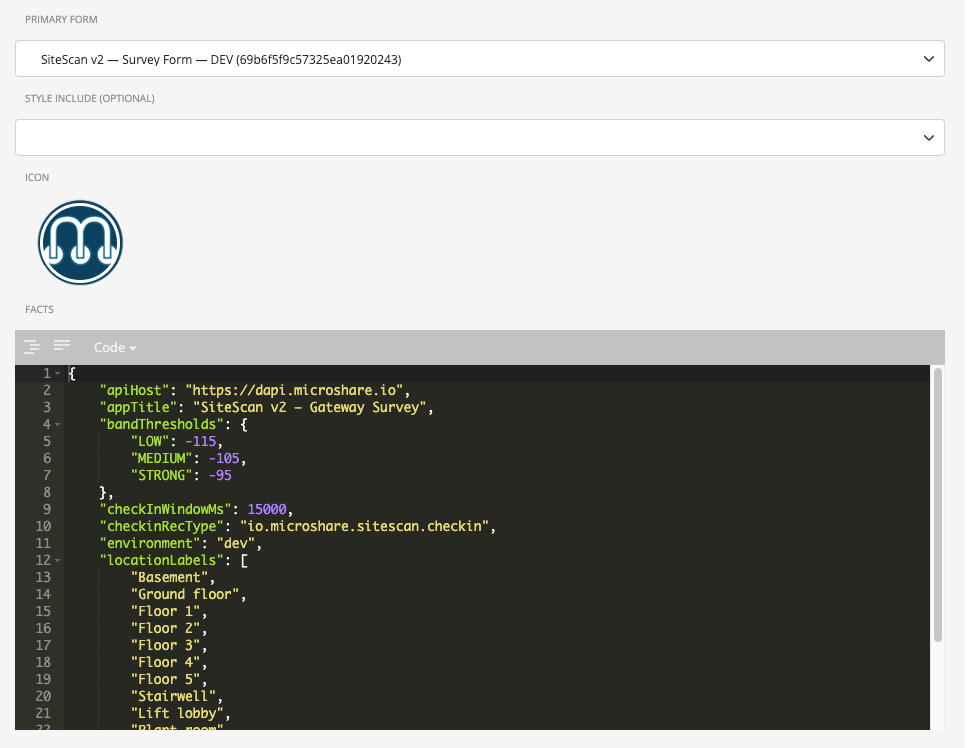

# SiteScan — Microshare Composer Setup Guide

This guide walks you through deploying SiteScan entirely inside the Microshare platform using Composer. No server, no build tools, no command line required — everything is done through the Composer web UI at [composer.microshare.io](https://composer.microshare.io) (or [dcomposer.microshare.io](https://dcomposer.microshare.io) for the dev environment).

---

## Overview

SiteScan uses four Composer artifacts that work together:

| Artifact | File | What it does |
|----------|------|--------------|
| **Robot** | `robot/sitescan-decode-robot.js` | Listens for raw uplinks (`io.microshare.openclose.unpacked`), extracts signal metrics, and writes a clean `io.microshare.sitescan.decoded` record with RSSI, SNR, ESP, band, gateway info, etc. |
| **Form** | `form/sitescan-form-v2.html` | The app UI — a single HTML file that runs inside the Composer App container. Contains all JavaScript, CSS, and logic; no external dependencies. |
| **App** | `app/sitescan-facts-v2.json` | The Composer App object that binds the Form + Facts (configuration) together and generates the shareable app URL |

---

## Prerequisites

- Access to [composer.microshare.io](https://composer.microshare.io) with an account that has **Robot**, **Form**, and **App** creation rights
- At least one **Browan Tabs TBDW100** sensor enrolled in a Microshare Device Cluster with recType `io.microshare.openclose.unpacked`
- The sensor must be within LoRaWAN range of a gateway and sending uplinks

---

## Step 1 — Create the Robot

The Robot decodes every incoming raw uplink into a clean `io.microshare.sitescan.decoded` record.

1. Go to **composer.microshare.io → Robots → Create New**
2. **Name**: `SiteScan Decode Robot`
3. **Trigger recType**: `io.microshare.openclose.unpacked`
4. In the **Script** field, paste the entire contents of [`robot/sitescan-decode-robot.js`](robot/sitescan-decode-robot.js)
5. Toggle **Active** to enable the robot
6. Click **Save**
7. Note the Robot ID shown in the URL or details panel (you won't need it for the form, but keep it for reference)

**Verify it works:** Trigger your TBDW100 sensor (pass a magnet near it). Within a few seconds, go to **Composer → Robot Logs** and you should see a line like:

```
SiteScan Robot: wrote decoded devEui=58A0CB0000102AFC band=STRONG rssi=-62 snr=10.5 sf=7 gw=1
```

You can also verify by querying `https://dapi.microshare.io/share/io.microshare.sitescan.decoded` — records should appear.

---

## Step 2 — Create the Form

The Form is the actual mobile app UI — a self-contained HTML file.

1. Go to **composer.microshare.io → Forms → Create New**
2. **Name**: `SiteScan Form v2`
3. Paste the **entire contents** of [`form/sitescan-form-v2.html`](form/sitescan-form-v2.html) into the HTML field

   > Use the **v2 form** (`sitescan-form-v2.html`) — it is the recommended version with location tagging, ESP display, configurable band thresholds, and session persistence.

4. Click **Save**
5. Note the Form ID

---

## Step 3 — Create the App

The App binds the Form and configuration (Facts) together, and generates the URL you share with field technicians.

1. Go to **composer.microshare.io → Apps → Create New**
2. **Name**: `SiteScan`
3. **App Type**: Display
4. **Style Choice**: Showcase
5. **Form to Display**: select the Form you created in Step 3 (`SiteScan Form v2`)
6. **Facts to Display**: paste and edit the contents of [`app/sitescan-facts-v2.json`](app/sitescan-facts-v2.json)

### Key Facts to configure

```json
{
  "appTitle":         "SiteScan v2 — Gateway Survey",
  "environment":      "dev",
  "apiHost":          "https://dapi.microshare.io",
  "rawUplinkRecType": "io.microshare.openclose.unpacked",
  "checkinRecType":   "io.microshare.sitescan.checkin",
  "sessionRecType":   "io.microshare.sitescan.session",
  "pollIntervalMs":   8000,
  "checkInWindowMs":  15000,
  "bandThresholds": {
    "strong":   -95,
    "medium":  -105,
    "low":     -115
  },
  "locationLabels": [
    "Basement", "Ground floor", "Floor 1", "Floor 2", "Floor 3",
    "Stairwell", "Lift lobby", "Plant room", "External"
  ]
}
```

| Key | Description |
|-----|-------------|
| `environment` | `"dev"` (use `dapi.microshare.io`) or `"prod"` (use `api.microshare.io`) |
| `apiHost` | `https://dapi.microshare.io` for dev, `https://api.microshare.io` for prod |
| `rawUplinkRecType` | Must be `io.microshare.openclose.unpacked` — the recType your TBDW100 writes to |
| `pollIntervalMs` | How often (ms) the app polls for new uplinks. `8000` = 8 seconds |
| `checkInWindowMs` | How long (ms) the app waits after a Check In tap to match an uplink. `15000` = 15 seconds |
| `bandThresholds` | RSSI (ESP) thresholds in dBm for each band. Adjust to match your deployment requirements |
| `locationLabels` | **Customise this for every deployment.** These appear as one-tap tag buttons on the survey screen so the technician can label each reading with a zone (e.g. "Floor 3", "Plant room"). Replace the default list with the actual areas of the building being surveyed — e.g. `["Reception", "Server room", "Floor 1 East", "Floor 1 West", "Roof terrace"]`. There is no limit on the number of labels. If omitted entirely, the location tag buttons will not appear. |



7. Click **Save**
8. Open the App URL shown in the Composer App details panel

---

## Using the App

1. Open the App URL on your phone (add to home screen for best experience)
2. Log in with your Microshare credentials
3. On the **Device Select** screen: the app will list sensors that have sent uplinks in the last 48 hours. Select your TBDW100, or type the DevEUI manually if it does not appear
4. Enter an optional **Survey Location** label (e.g. "Building A, Floor 2") — this appears in the exported data
5. Tap **Begin Survey**
6. At each survey point:
   - Trigger the sensor by passing the magnet near the sensor body (you will feel a subtle click or see the LED flash briefly)
   - Tap **+ Manual check-in** (or wait — the app also picks up uplinks automatically during the poll window)
   - The app will display the signal band (STRONG / MEDIUM / LOW / NO_SIGNAL) within 8 seconds, with haptic feedback
   - Optionally tap a **location tag** (e.g. "Floor 2") to tag the reading with the current area
   - Add a note if needed (e.g. "behind lift shaft")
7. At the end of the survey, tap **End**
8. Review the **Summary** screen: packet success rate, band distribution by area, full readings table
9. Tap **Export CSV** or **Export JSON** to save the data

---

## Troubleshooting

**"No devices found" on the device select screen**
The app queries the last 48 hours of `io.microshare.openclose.unpacked` records. If nothing appears, either:
- The sensor has not sent any uplinks recently — trigger it manually and wait 10 seconds, then retry
- The Device Cluster is not active or the sensor is not enrolled correctly in Microshare
- Your Microshare account does not have Read permission on `io.microshare.openclose.unpacked`

**"No signal / timeout" after triggering the sensor**
- The sensor may be out of LoRaWAN range — check that the gateway is powered and within range
- The Robot may not have processed the uplink yet — wait 10–15 seconds and try again
- Check **Composer → Robot Logs** to see if the Robot is receiving and processing uplinks

**"Check-in not matching" (app shows timeout even though sensor was triggered)**
- Tap **Check In AFTER** triggering the sensor, not before. The app has an 8-second lookback window, so triggering the sensor up to 8 seconds before tapping is fine — but tapping first and triggering after will not match
- The 15-second window after tapping is also checked — so you have a total window of 8s before + 15s after = 23 seconds to trigger and match

**Robot not writing `io.microshare.sitescan.decoded` records**
- Ensure the Robot is **Active** (toggle in Robot details)
- Ensure the trigger recType is exactly `io.microshare.openclose.unpacked` (case-sensitive)
- Check Robot Logs for errors

**401 / 403 errors in the app**
If the app shows authentication or permission errors, create Rules in Composer:

| recType | Operation | Who |
|---------|-----------|-----|
| `io.microshare.openclose.unpacked` | Read | Your org |
| `io.microshare.sitescan.decoded` | Read | Your org |
| `io.microshare.sitescan.checkin` | Write | Your org |
| `io.microshare.sitescan.session` | Write | Your org |

---

## Promoting to Production

When development testing is complete:
1. Recreate all objects (Robot, Form, App) on [composer.microshare.io](https://composer.microshare.io) (not dcomposer)
2. Update the App Facts:
   ```json
   "environment": "prod",
   "apiHost":     "https://api.microshare.io"
   ```

---

## Optional: Automated Deploy with deploy.mjs

If you have existing SiteScan objects in Composer and want to update them programmatically, use the Node.js deploy script:

```bash
cd microshare-native
cp .env.example .env
# Edit .env with your Microshare credentials
node deploy.mjs --env dev
```

The script will find any Composer objects whose name contains "sitescan" (case-insensitive) and PUT the local source files to them. Objects that don't exist yet must be created manually in the UI first.
